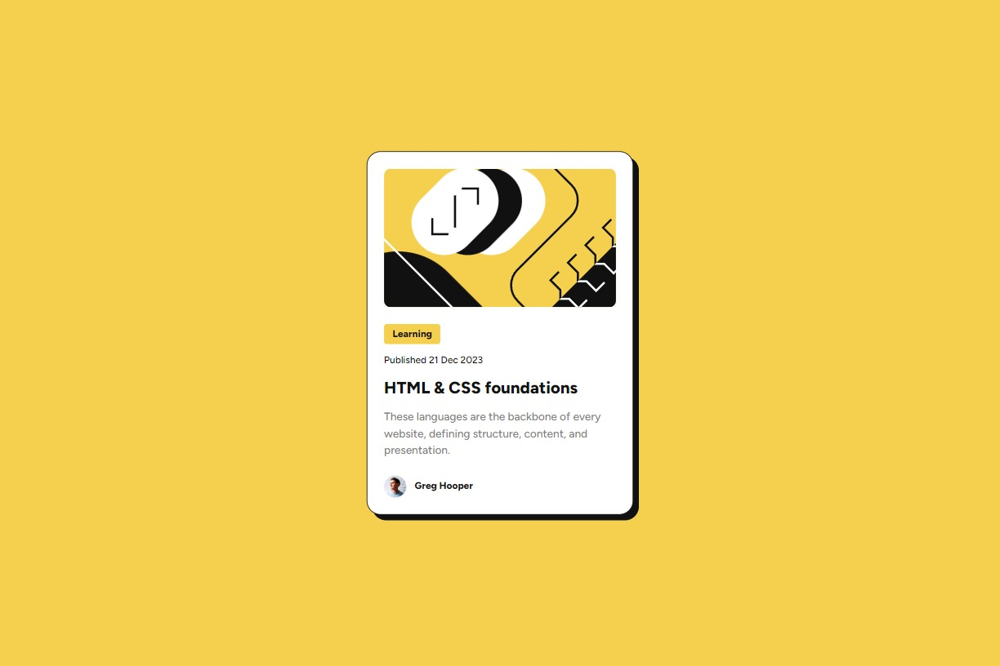

# Frontend Mentor - Blog preview card solution

This is a solution to the [Blog preview card challenge on Frontend Mentor](https://www.frontendmentor.io/challenges/blog-preview-card-ckPaj01IcS). Frontend Mentor challenges help you improve your coding skills by building realistic projects. 

## Table of contents

- [Overview](#overview)
  - [The challenge](#the-challenge)
  - [Screenshot](#screenshot)
  - [Links](#links)
- [My process](#my-process)
  - [Built with](#built-with)
  - [What I learned](#what-i-learned)
  - [Continued development](#continued-development)
  - [Useful resources](#useful-resources)
- [Author](#author)

**Note: Delete this note and update the table of contents based on what sections you keep.**

## Overview

### The challenge

Users should be able to:

- See hover and focus states for all interactive elements on the page

### Screenshot



### Links

- [Solution URL](https://github.com/NikaDalalishvili/recipe-page)
- [Live Site URL](https://nikadalalishvili.github.io/recipe-page/)

## My process

### Built with

- Semantic HTML5 markup
- CSS custom properties
- Flexbox
- Mobile-first workflow
- [Sassy Cascading Style Sheets](https://sass-lang.com/documentation/at-rules/control/for/) - scss

### What I learned

Nothing special, it was simple, what was new to me was the time tag, but I understood it easily.

```html
<time datetime="2023-12-21">21 Dec 2023</time>
```

### Continued development

First I want to finish the javascript course I'm taking on freecodecamp, I'm also going through the learning path on Frontendmentor, and after that I want to focus more on React, Next.js and Node.js.

### Useful resources

- [ChatGPT](https://chatgpt.com/) - He is my hero, if I need something fast, if I can't understand something, or if I can't find it on the internet, I always ask him.
- [W3Schools](https://www.w3schools.com/) - This is my favorite documentation platform I've been using since I started programming, it's the best explained resource.
- [YouTube](https://www.youtube.com/) - I'm always looking for news and listening to other developers, sharing their experiences so that I can see many different solutions to a problem.

## Author

### DalaScript Project Social links

- Instagram - [@DalaScript](https://www.instagram.com/DalaScript)
- YouTube - [@DalaScript](https://www.youtube.com/@DalaScript)
- TikTok - [@DalaScript](https://www.tiktok.com/@Dalascript)
- FrontendMentor - [@NikaDalalishvili](https://www.frontendmentor.io/profile/NikaDalalishvili)

### Personal Social links

- Instagram - [@nika.dala](https://www.instagram.com/nika.dala/)
- TikTok - [@nika.dala](https://www.tiktok.com/@nika.dala)
- LinkedIn - [@nika.dala](https://www.linkedin.com/in/nikadala/)
- UpWork - [@Nika Dalalishvili](https://www.upwork.com/freelancers/~01fcf99c6c9609988e)
